# Inference-Perf Benchmark Report

### Workload profile

```yaml
# X-37 — Long prefix (~8k), output=1000, 63% under-fill, Poisson arrivals
#
# FIXED (per pod)
# - KV_cap (effective, min TP rank): 461,376 tokens
# - Prompt shape:
#     L_shared   = 8,000      # long system prompt
#     L_question = 1,000      # unique per request
#     L_output   = 1,000  → live decode L_live ≈ 500 (streaming steady-state)
#
# CONCURRENCY ASSUMPTION (for slot math)
# - Take C ≈ 8 in-flight / pod at the higher stages
#
# CAPACITY → SLOTS (include decode + unique question in ephemeral)
# - Ephemeral per request      = L_question + L_live = 1,000 + 500 = 1,500
# - Ephemeral per pod          = C * 1,500 = 8 * 1,500 = 12,000
# - Remaining KV per pod       = 461,376 − 12,000 = 449,376
# - Slots per pod              = floor(449,376 / 8,000) = 56
# - Slots cluster-wide (4 pods)= 4 * 56 = 224
#
# WORKING SET & OVERFILL
# - num_groups (distinct prefixes) G = 83
# - Overfill% = (G − slots_cluster) / slots_cluster × 100
#              = (83 − 224) / 224 * 100 ≈ -63% (under-fill)
# - num_prompts_per_group P = 3 → One FULL SET S = G * P = 83 * 3 = 249 requests
#
# SENSITIVITY NOTE (if concurrency rises to C=10):
# - Ephemeral/pod = 15,000 → Remaining/pod = 446,376 → Slots/pod = 55 → Slots/cluster = 220
#
load:
  type: constant
  stages:
    - rate: 10           # warmup phase    
      duration: 25
    - rate: 3
      duration: 210
    - rate: 4
      duration: 180
    - rate: 5
      duration: 120
    - rate: 6
      duration: 120
    - rate: 8
      duration: 90
    - rate: 10
      duration: 70
    - rate: 12
      duration: 60
    - rate: 15
      duration: 50
    - rate: 20
      duration: 50
api:
  type: completion
  streaming: true

server:
  type: vllm
  model_name: meta-llama/Llama-3.1-70B-Instruct
  base_url: <gateway-endpoint>
  ignore_eos: true

tokenizer:
  pretrained_model_name_or_path: meta-llama/Llama-3.1-70B-Instruct

data:
  type: shared_prefix
  shared_prefix:
    num_groups: 83              
    num_prompts_per_group: 3
    system_prompt_len: 8000
    question_len: 1000
    output_len: 1000

report:
  request_lifecycle:
    summary: true
    per_stage: true
    per_request: true

storage:
  local_storage:
    path: /workspace
```

### Scheduler Configurations

**estimate-prefix-cache_load**

```yaml
apiVersion: inference.networking.x-k8s.io/v1alpha1
kind: EndpointPickerConfig
plugins:
- type: active-request-scorer
- type: kv-cache-scorer
- type: prefix-cache-scorer
  parameters:
    hashBlockSize: 256
    maxPrefixBlocksToMatch: 256
    lruCapacityPerServer: 2200
- type: max-score-picker
  parameters:
    maxNumOfEndpoints: 1
- type: single-profile-handler
schedulingProfiles:
- name: default
  plugins:
  - pluginRef: active-request-scorer
    weight: 1
  - pluginRef: kv-cache-scorer
    weight: 1
  - pluginRef: prefix-cache-scorer
    weight: 2
  - pluginRef: max-score-picker
```

**load**

```yaml
apiVersion: inference.networking.x-k8s.io/v1alpha1
kind: EndpointPickerConfig
plugins:
- type: active-request-scorer
- type: kv-cache-scorer
- type: max-score-picker
  parameters:
    maxNumOfEndpoints: 1
- type: single-profile-handler
schedulingProfiles:
- name: default
  plugins:
  - pluginRef: active-request-scorer
    weight: 1
  - pluginRef: kv-cache-scorer
    weight: 1
  - pluginRef: max-score-picker
```

**precise-prefix-cache_load**

```yaml
apiVersion: inference.networking.x-k8s.io/v1alpha1
kind: EndpointPickerConfig
plugins:
- type: single-profile-handler
- type: prefix-cache-scorer
  parameters:
    mode: cache_tracking
    indexerConfig:
      tokenProcessorConfig:
        blockSize: 64   
        hashSeed: "42"
      kvBlockIndexConfig:
        enableMetrics: true    
        metricsLoggingInterval: 60000000000 
- type: kv-cache-scorer
- type: active-request-scorer
- type: max-score-picker
schedulingProfiles:
- name: default
  plugins:
    - pluginRef: prefix-cache-scorer
      weight: 2.0
    - pluginRef: kv-cache-scorer
      weight: 1.0
    - pluginRef: active-request-scorer
      weight: 1.0
    - pluginRef: max-score-picker
```

**random**

```yaml
apiVersion: inference.networking.x-k8s.io/v1alpha1
kind: EndpointPickerConfig
plugins:
- type: single-profile-handler
- type: random-picker
schedulingProfiles:
- name: default
  plugins:
    - pluginRef: random-picker
```

## Charts

### Latency vs QPS

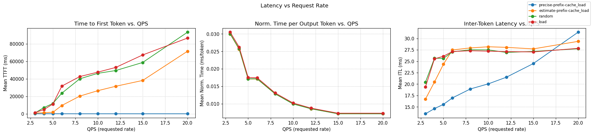

### Throughput vs QPS

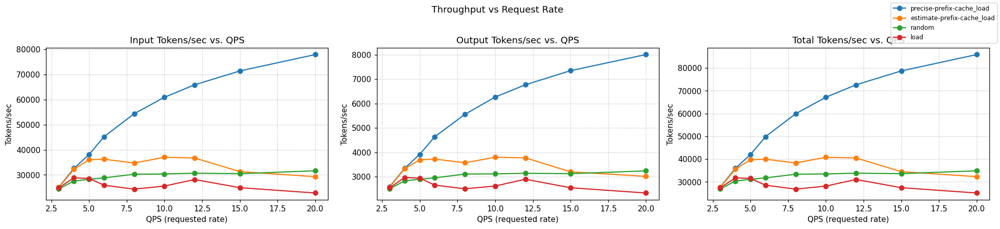

### TTFT p90 vs QPS

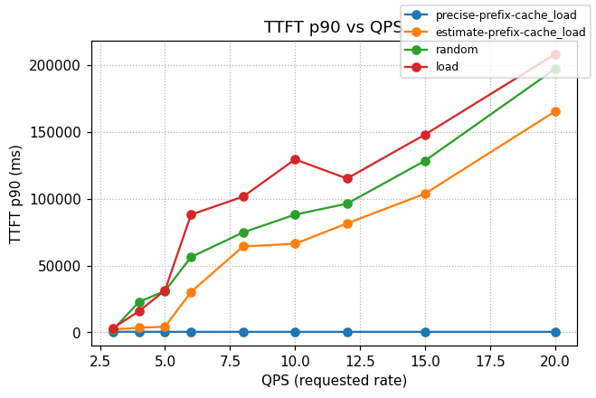

### Waiting Queue vs Time

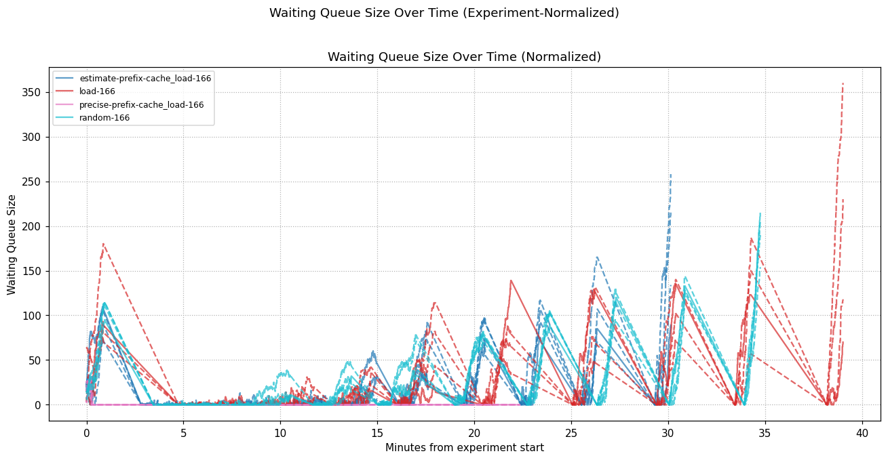

### KV Cache Usage vs Time

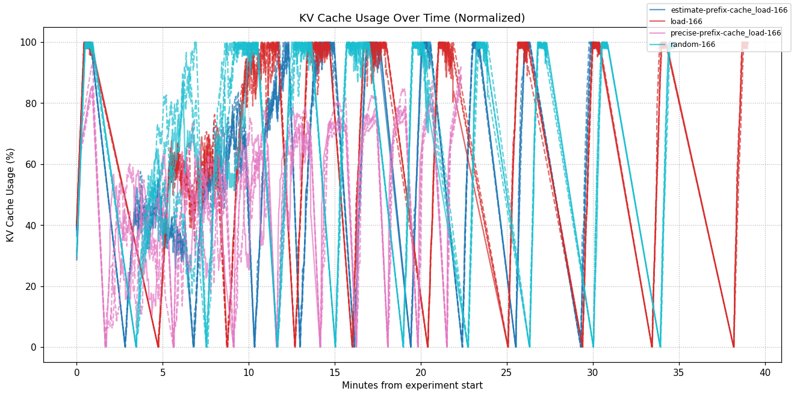

### EPP Metrics Comparative Analysis

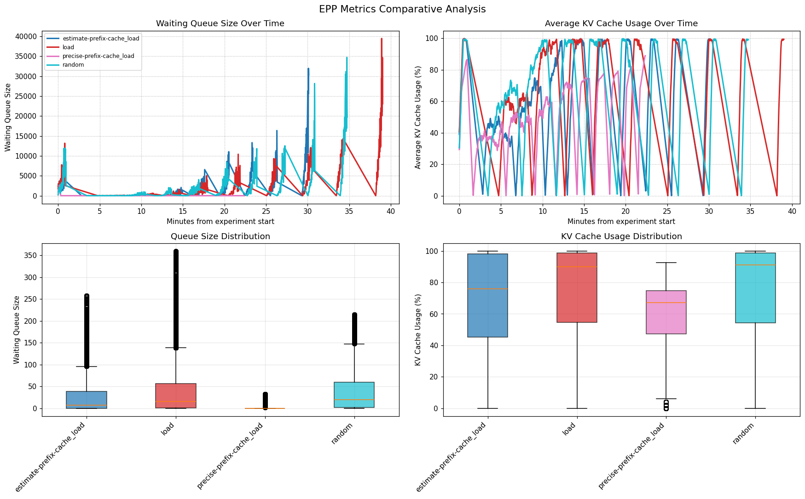

### How to read this report (quick)

- **Output tokens/sec** is the primary throughput metric (higher is better).

- **Requests/sec** shows the rate of completed requests.

- **Success Rate** reflects outcome quality, not volume.

- **TTFT** is time to first token; **ITL** is the gap between tokens (both lower is better).

- **Queue sizes** and **KV cache usage** show resource utilization patterns.


### Summary across QPS


| Experiment | Output toks/s | Requests/s | Success Rate | TTFT p90 (s) | TTFT mean (s) | ITL mean (s) | ITL p50/ p90 (s) |
|---|---:|---:|---:|---:|---:|---:|---:|
| precise-prefix-cache_load | 5380.9 | 6.913 | 100.00% | 0.409 | 0.259 | 0.020 | 0.0000/0.097 |
| estimate-prefix-cache_load | 3408.6 | 6.920 | 100.00% | 64.430 | 25.337 | 0.026 | 0.0000/0.100 |
| random | 2991.5 | 7.122 | 100.00% | 84.938 | 40.915 | 0.026 | 0.0000/0.100 |
| load | 2669.0 | 6.921 | 97.71% | 98.318 | 40.689 | 0.026 | 0.0000/0.100 |

### EPP Queue and KV Cache Metrics Summary


| Experiment | Wait Queue (mean/p90/max) | KV Cache % (mean/p90/max) | Pods | Data Points |
|---|---:|---:|---:|---:|
| estimate-prefix-cache_load | 26.8/80/258 | 69.0/99.5/100.0 | 4 | 56576 |
| load | 37.6/106/360 | 74.1/99.5/100.0 | 4 | 56624 |
| precise-prefix-cache_load | 0.5/0/32 | 59.3/80.2/92.6 | 4 | 56936 |
| random | 36.6/99/214 | 75.0/99.5/100.0 | 4 | 57056 |

## Per-QPS Results


### QPS = 3.0


| Experiment | Output toks/s | Requests/s | Success Rate | TTFT p90 (s) | TTFT mean (s) | ITL mean (s) | ITL p50/ p90 (s) |
|---|---:|---:|---:|---:|---:|---:|---:|
| precise-prefix-cache_load | 2590.0 | 3.003 | 100.00% | 0.400 | 0.246 | 0.013 | 0.0000/0.088 |
| random | 2505.7 | 3.001 | 100.00% | 2.000 | 1.102 | 0.020 | 0.0000/0.100 |
| estimate-prefix-cache_load | 2573.6 | 3.001 | 100.00% | 2.200 | 1.007 | 0.017 | 0.0000/0.100 |
| load | 2545.4 | 3.014 | 100.00% | 3.299 | 1.548 | 0.019 | 0.0000/0.100 |

### QPS = 4.0


| Experiment | Output toks/s | Requests/s | Success Rate | TTFT p90 (s) | TTFT mean (s) | ITL mean (s) | ITL p50/ p90 (s) |
|---|---:|---:|---:|---:|---:|---:|---:|
| precise-prefix-cache_load | 3345.2 | 4.007 | 100.00% | 0.486 | 0.304 | 0.015 | 0.0000/0.095 |
| estimate-prefix-cache_load | 3326.3 | 4.018 | 100.00% | 3.402 | 1.497 | 0.020 | 0.0000/0.100 |
| load | 2967.6 | 4.004 | 100.00% | 15.818 | 5.021 | 0.026 | 0.0000/0.100 |
| random | 2829.5 | 4.002 | 100.00% | 22.814 | 7.257 | 0.026 | 0.0000/0.100 |

### QPS = 5.0


| Experiment | Output toks/s | Requests/s | Success Rate | TTFT p90 (s) | TTFT mean (s) | ITL mean (s) | ITL p50/ p90 (s) |
|---|---:|---:|---:|---:|---:|---:|---:|
| precise-prefix-cache_load | 3916.7 | 5.004 | 100.00% | 0.400 | 0.270 | 0.016 | 0.0000/0.100 |
| estimate-prefix-cache_load | 3691.2 | 5.017 | 100.00% | 4.322 | 1.919 | 0.024 | 0.0000/0.100 |
| random | 2898.2 | 5.009 | 100.00% | 30.994 | 11.988 | 0.026 | 0.0000/0.100 |
| load | 2943.6 | 5.000 | 100.00% | 31.501 | 11.329 | 0.026 | 0.0000/0.100 |

### QPS = 6.0


| Experiment | Output toks/s | Requests/s | Success Rate | TTFT p90 (s) | TTFT mean (s) | ITL mean (s) | ITL p50/ p90 (s) |
|---|---:|---:|---:|---:|---:|---:|---:|
| precise-prefix-cache_load | 4640.3 | 6.005 | 100.00% | 0.400 | 0.271 | 0.017 | 0.0000/0.100 |
| estimate-prefix-cache_load | 3724.3 | 6.015 | 100.00% | 30.211 | 9.700 | 0.027 | 0.0000/0.100 |
| random | 2955.9 | 6.005 | 100.00% | 56.371 | 23.742 | 0.027 | 0.0000/0.100 |
| load | 2656.5 | 6.020 | 100.00% | 88.121 | 31.824 | 0.027 | 0.0000/0.100 |

### QPS = 8.0


| Experiment | Output toks/s | Requests/s | Success Rate | TTFT p90 (s) | TTFT mean (s) | ITL mean (s) | ITL p50/ p90 (s) |
|---|---:|---:|---:|---:|---:|---:|---:|
| precise-prefix-cache_load | 5557.1 | 8.008 | 100.00% | 0.400 | 0.248 | 0.019 | 0.0000/0.100 |
| estimate-prefix-cache_load | 3571.6 | 8.009 | 100.00% | 64.280 | 20.389 | 0.028 | 0.0000/0.100 |
| random | 3108.8 | 8.009 | 100.00% | 74.757 | 40.124 | 0.028 | 0.0000/0.100 |
| load | 2506.3 | 8.027 | 100.00% | 101.514 | 42.683 | 0.027 | 0.0000/0.100 |

### QPS = 10.0


| Experiment | Output toks/s | Requests/s | Success Rate | TTFT p90 (s) | TTFT mean (s) | ITL mean (s) | ITL p50/ p90 (s) |
|---|---:|---:|---:|---:|---:|---:|---:|
| precise-prefix-cache_load | 6264.0 | 10.001 | 100.00% | 0.400 | 0.242 | 0.020 | 0.0000/0.100 |
| estimate-prefix-cache_load | 3798.6 | 10.014 | 100.00% | 66.291 | 26.567 | 0.028 | 0.0000/0.100 |
| random | 3117.3 | 10.007 | 100.00% | 88.089 | 46.359 | 0.027 | 0.0000/0.100 |
| load | 2620.3 | 10.000 | 100.00% | 129.421 | 47.727 | 0.027 | 0.0000/0.100 |

### QPS = 12.0


| Experiment | Output toks/s | Requests/s | Success Rate | TTFT p90 (s) | TTFT mean (s) | ITL mean (s) | ITL p50/ p90 (s) |
|---|---:|---:|---:|---:|---:|---:|---:|
| precise-prefix-cache_load | 6765.9 | 12.019 | 100.00% | 0.400 | 0.255 | 0.022 | 0.0000/0.100 |
| estimate-prefix-cache_load | 3773.5 | 12.017 | 100.00% | 81.511 | 31.615 | 0.028 | 0.0000/0.100 |
| random | 3140.8 | 12.020 | 100.00% | 96.284 | 49.556 | 0.027 | 0.0000/0.100 |
| load | 2897.6 | 12.021 | 100.00% | 115.098 | 53.087 | 0.027 | 0.0000/0.100 |

### QPS = 15.0


| Experiment | Output toks/s | Requests/s | Success Rate | TTFT p90 (s) | TTFT mean (s) | ITL mean (s) | ITL p50/ p90 (s) |
|---|---:|---:|---:|---:|---:|---:|---:|
| precise-prefix-cache_load | 7345.1 | 15.029 | 100.00% | 0.400 | 0.247 | 0.024 | 0.0000/0.089 |
| estimate-prefix-cache_load | 3200.9 | 15.028 | 100.00% | 103.779 | 38.253 | 0.028 | 0.0000/0.100 |
| random | 3126.2 | 15.027 | 100.00% | 128.434 | 58.760 | 0.027 | 0.0000/0.098 |
| load | 2549.1 | 15.029 | 100.00% | 148.000 | 67.339 | 0.027 | 0.0000/0.099 |

### QPS = 20.0


| Experiment | Output toks/s | Requests/s | Success Rate | TTFT p90 (s) | TTFT mean (s) | ITL mean (s) | ITL p50/ p90 (s) |
|---|---:|---:|---:|---:|---:|---:|---:|
| precise-prefix-cache_load | 8003.9 | 20.040 | 100.00% | 0.400 | 0.250 | 0.031 | 0.0000/0.100 |
| estimate-prefix-cache_load | 3017.1 | 20.005 | 100.00% | 165.276 | 71.632 | 0.029 | 0.0000/0.100 |
| random | 3241.0 | 20.040 | 100.00% | 197.010 | 93.345 | 0.028 | 0.0000/0.098 |
| load | 2334.5 | 20.039 | 85.00% | 208.052 | 86.643 | 0.028 | 0.0000/0.099 |

## Per-Pod EPP Metrics

Individual pod metrics over the duration of each experiment.


### Experiment: estimate-prefix-cache_load

**Pod:** `estimate-prefix-cache_load- pod1`

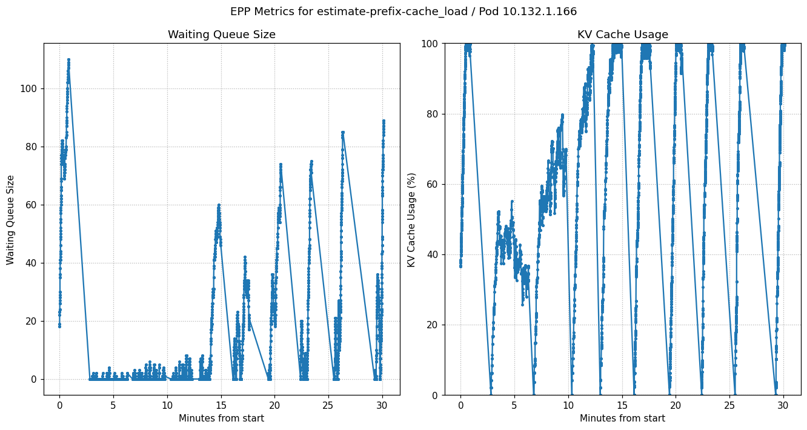

**Pod:** `estimate-prefix-cache_load- pod2`


**Pod:** `estimate-prefix-cache_load- pod3`

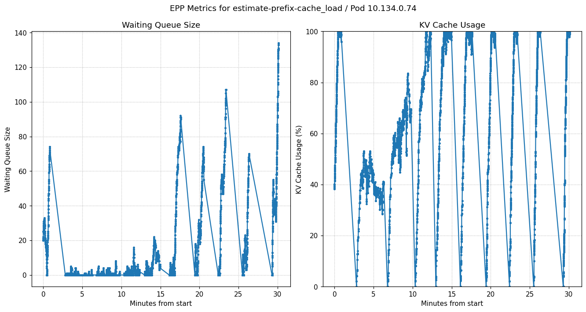

**Pod:** `estimate-prefix-cache_load- pod4`

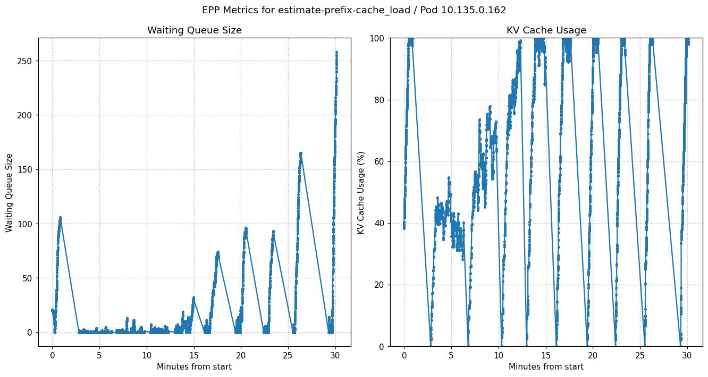


### Experiment: load

**Pod:** `load- pod1`

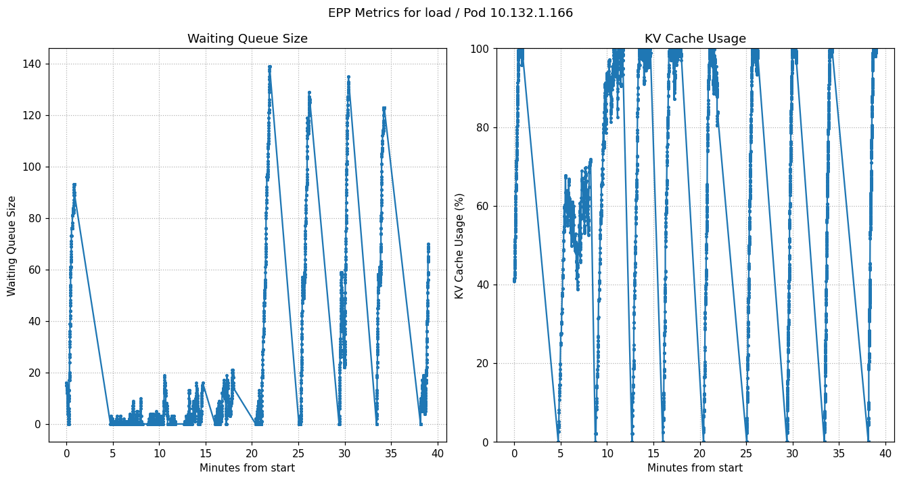

**Pod:** `load- pod2`

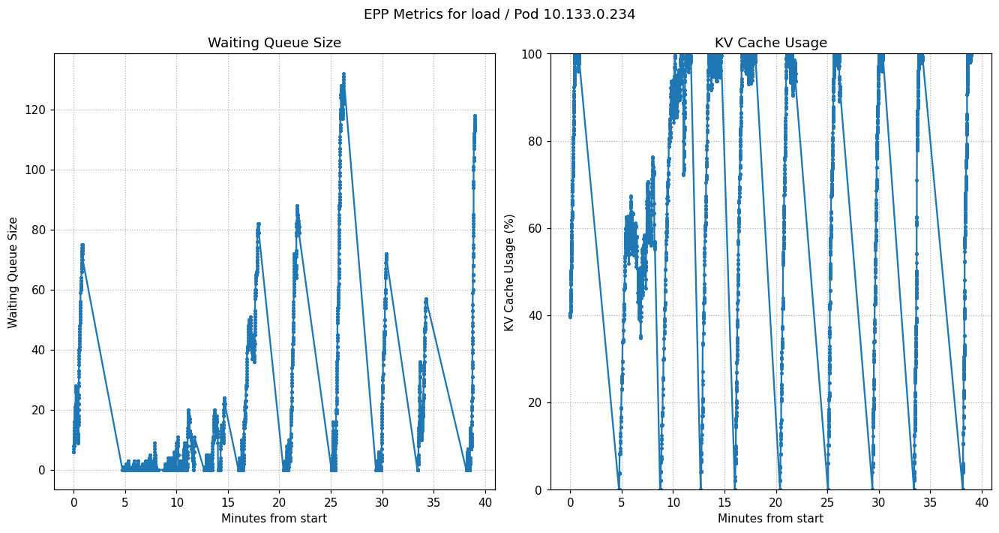

**Pod:** `load- pod3`

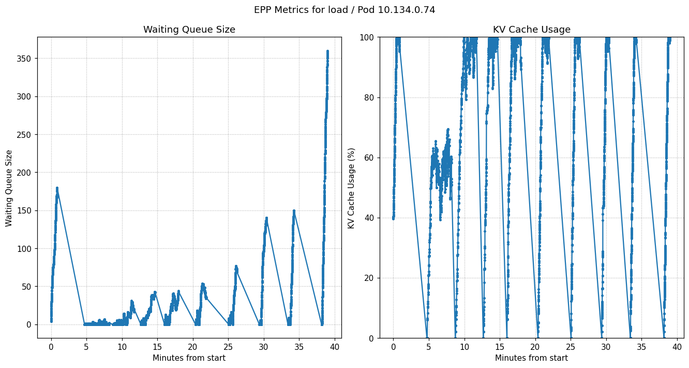

**Pod:** `load- pod4`

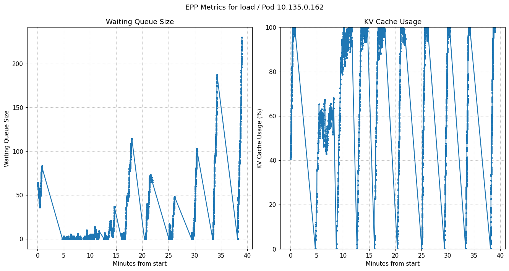


### Experiment: precise-prefix-cache_load

**Pod:** `precise-prefix-cache_load- pod1`

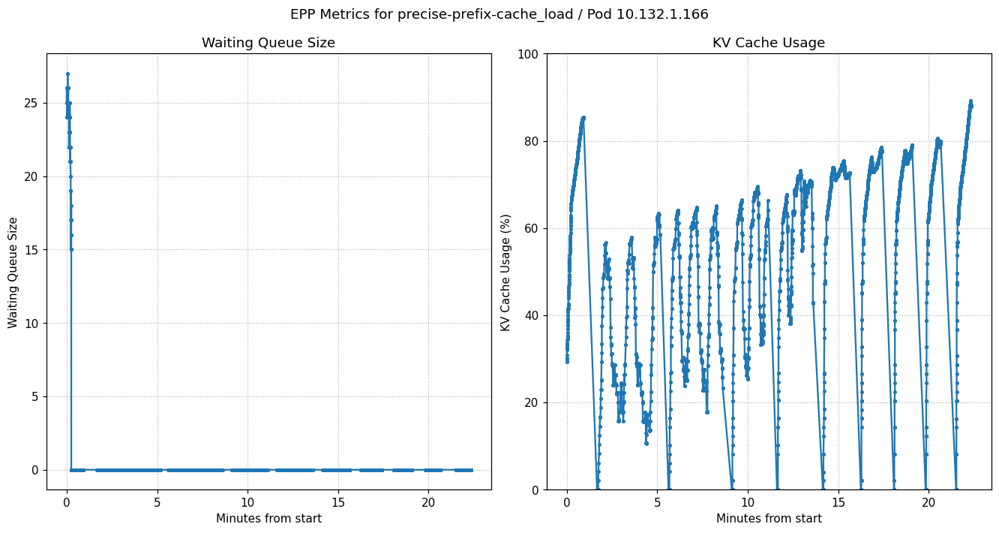

**Pod:** `precise-prefix-cache_load- pod2`

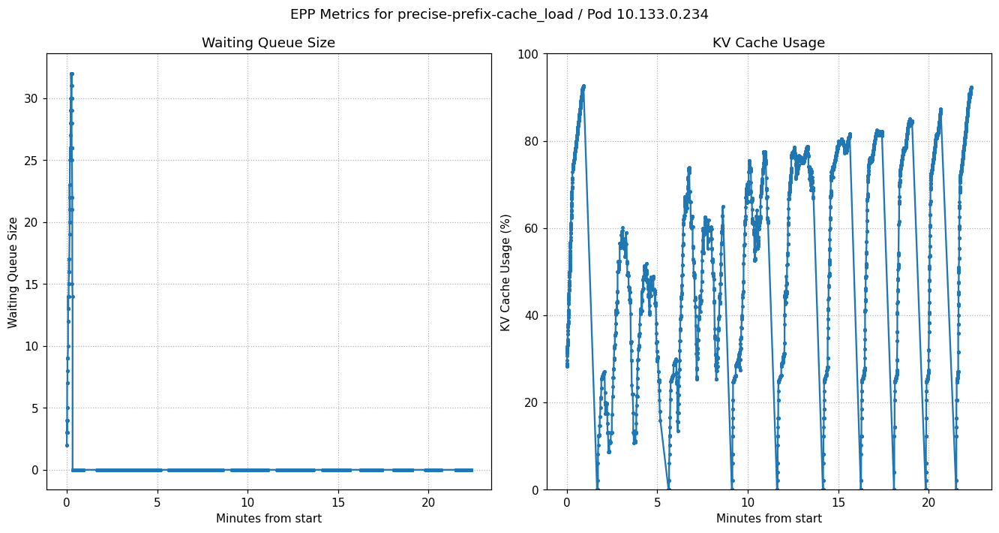

**Pod:** `precise-prefix-cache_load- pod3`

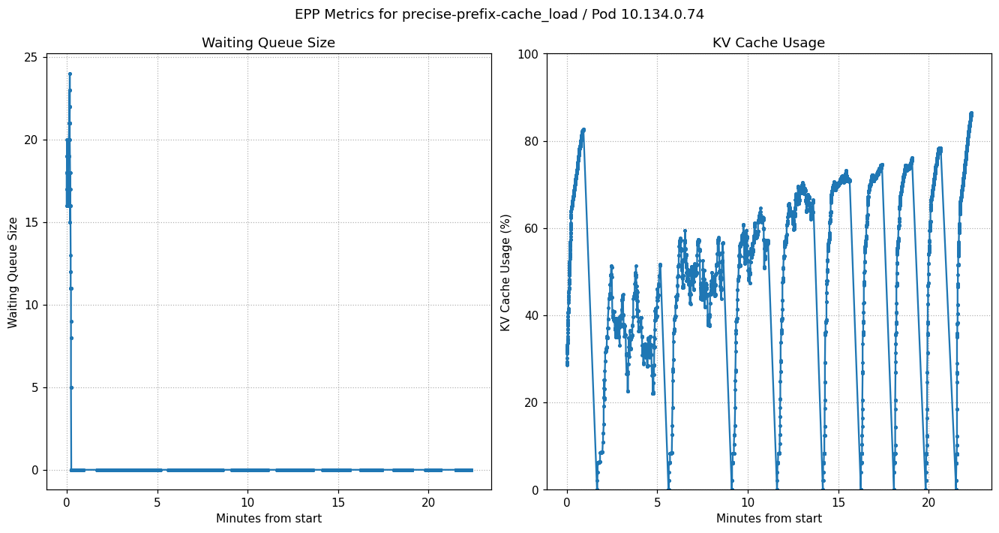

**Pod:** `precise-prefix-cache_load- pod4`

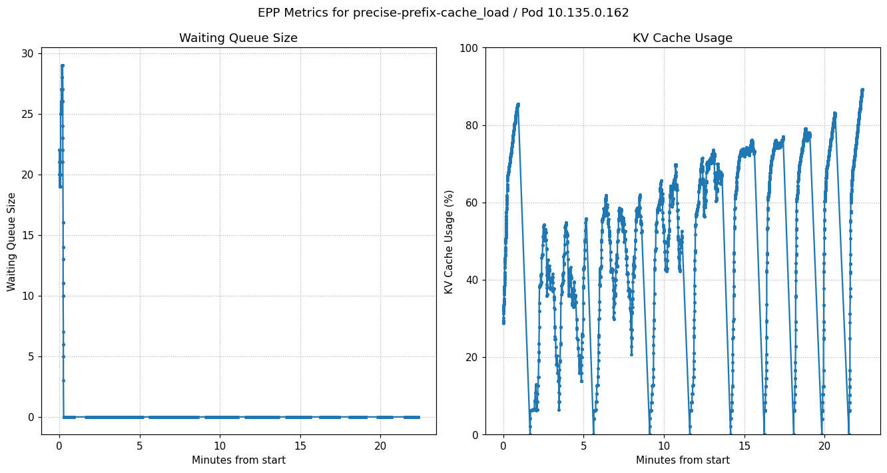


### Experiment: random

**Pod:** `random- pod1`

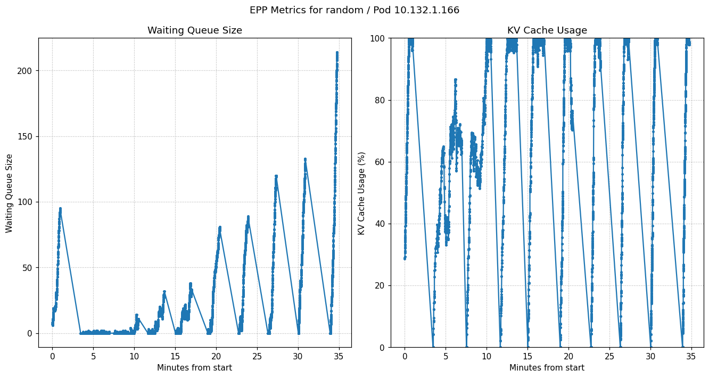

**Pod:** `random- pod2`

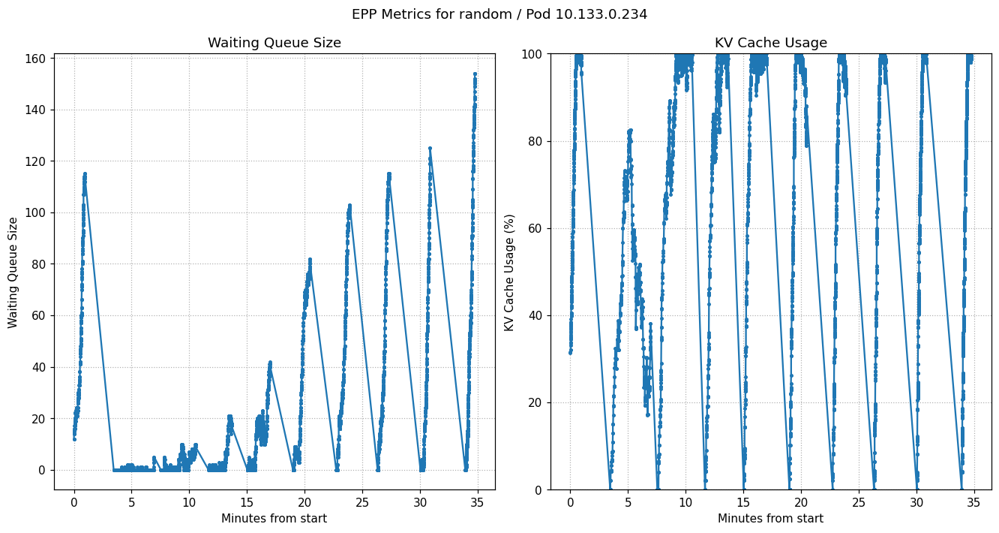

**Pod:** `random- pod3`

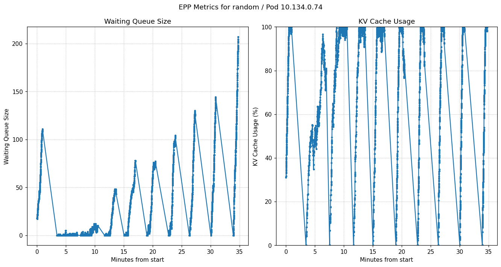

**Pod:** `random- pod4`

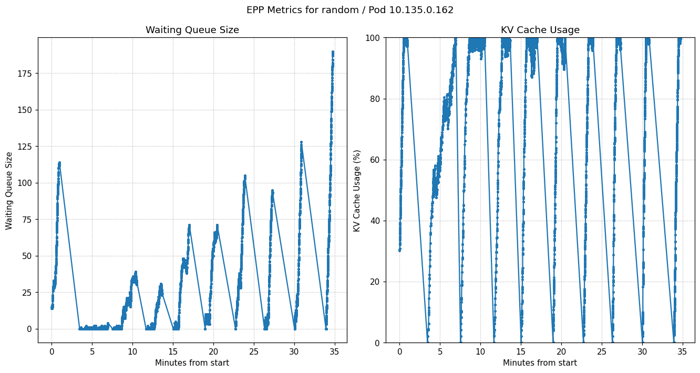
