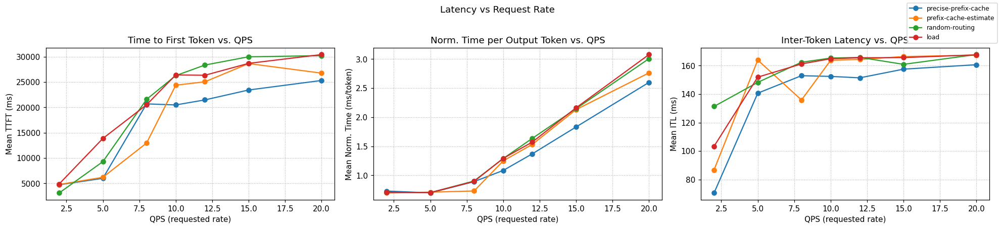
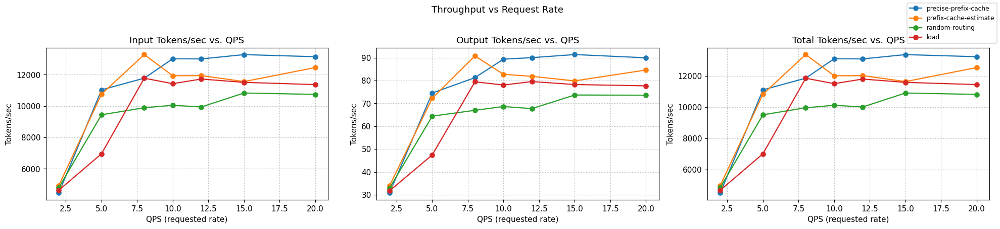

# InferencePerf Benchmark Report

## Configuration

### Workload profile

```yaml
load:
  type: constant
  stages:
  - rate: 2
    duration: 50
  - rate: 5
    duration: 50
  - rate: 8
    duration: 50
  - rate: 10
    duration: 50
  - rate: 12
    duration: 50
  - rate: 15
    duration: 50
  - rate: 20
    duration: 50
api:
  type: completion
  streaming: true
server:
  type: vllm
  model_name: meta-llama/Llama-3.1-70B-Instruct
  base_url: <endpoint>
  ignore_eos: true
tokenizer:
  pretrained_model_name_or_path: meta-llama/Llama-3.1-70B-Instruct
data:
  type: shared_prefix
  shared_prefix:
    num_groups: 80                
    num_prompts_per_group: 1     
    system_prompt_len: 2500       
    question_len: 256             
    output_len: 20               
report:
  request_lifecycle:
    summary: true
    per_stage: true
    per_request: true
storage:
  local_storage:
    path: /workspace
```

### Scheduler Configurations

**load**

```yaml
apiVersion: inference.networking.x-k8s.io/v1alpha1
kind: EndpointPickerConfig
plugins:
- type: queue-scorer
- type: kv-cache-scorer
- type: max-score-picker
  parameters:
    maxNumOfEndpoints: 1
- type: single-profile-handler
schedulingProfiles:
- name: default
  plugins:
  - pluginRef: queue-scorer
    weight: 1
  - pluginRef: kv-cache-scorer
    weight: 1
  - pluginRef: max-score-picker
```

**precise-prefix-cache**

```yaml
apiVersion: inference.networking.x-k8s.io/v1alpha1
kind: EndpointPickerConfig
plugins:
- type: single-profile-handler
- type: prefix-cache-scorer
  parameters:
    mode: cache_tracking
    indexerConfig:
      tokenProcessorConfig:
        blockSize: 64   
        hashSeed: "0"   
      kvBlockIndexConfig:
        enableMetrics: true    
        metricsLoggingInterval: 60000000000 
- type: kv-cache-scorer
- type: queue-scorer
- type: max-score-picker
schedulingProfiles:
- name: default
  plugins:
    - pluginRef: prefix-cache-scorer
      weight: 1.0
    - pluginRef: kv-cache-scorer
      weight: 1.0
    - pluginRef: queue-scorer
      weight: 1.0
    - pluginRef: max-score-picker
```

**prefix-cache-estimate**

```yaml
apiVersion: inference.networking.x-k8s.io/v1alpha1
kind: EndpointPickerConfig
plugins:
- type: queue-scorer
- type: kv-cache-scorer
- type: prefix-cache-scorer
  parameters:
    hashBlockSize: 64
    maxPrefixBlocksToMatch: 256
    lruCapacityPerServer: 31250
- type: max-score-picker
  parameters:
    maxNumOfEndpoints: 1
- type: single-profile-handler
schedulingProfiles:
- name: default
  plugins:
  - pluginRef: queue-scorer
    weight: 1
  - pluginRef: kv-cache-scorer
    weight: 1
  - pluginRef: prefix-cache-scorer
    weight: 1
  - pluginRef: max-score-picker
```

**random-routing**

```yaml
apiVersion: inference.networking.x-k8s.io/v1alpha1
kind: EndpointPickerConfig
plugins:
- type: single-profile-handler
- type: random-picker
schedulingProfiles:
- name: default
  plugins:
    - pluginRef: random-picker
```

## Charts

### Latency vs QPS



### Throughput vs QPS




### How to read this report (quick)

- **TTFT** is time to first token; **ITL** is the gap between tokens (both lower is better).
- **TTFT p50/p90** shows median/90th percentile latency for the first token.
- **Output tokens/sec** is the primary throughput metric (higher is better).

- **Requests/sec** shows the rate of completed requests.

- **Success Rate** reflects outcome quality, not volume.

### Summary across QPS


| Experiment | Output toks/s | Requests/s | Success Rate | TTFT mean (s) | TTFT p50/ p90 (s) | ITL mean (s) | ITL p50/ p90 (s) |
|---|---:|---:|---:|---:|---:|---:|---:|
| precise-prefix-cache | 78.2 | 5.496 | 100.00% | 21.172 | 22.345/33.219 | 0.153 | 0.0001/0.372 |
| prefix-cache-estimate | 75.1 | 5.173 | 100.00% | 22.953 | 24.778/31.966 | 0.160 | 0.0001/0.371 |
| load | 67.4 | 4.900 | 100.00% | 25.848 | 28.651/33.382 | 0.163 | 0.0001/0.371 |
| random-routing | 64.0 | 4.902 | 100.00% | 26.128 | 26.815/45.119 | 0.163 | 0.0001/0.370 |

## Per-QPS Results (sorted by **Output toks/s**, then **Success Rate**, then **TTFT**)


### QPS = 2.0


| Experiment | Output toks/s | Requests/s | Success Rate | TTFT mean (s) | TTFT p50/ p90 (s) | ITL mean (s) | ITL p50/ p90 (s) |
|---|---:|---:|---:|---:|---:|---:|---:|
| random-routing | 32.8 | 1.998 | 100.00% | 3.106 | 1.535/7.009 | 0.131 | 0.0001/0.348 |
| precise-prefix-cache | 30.8 | 1.925 | 100.00% | 4.728 | 1.941/15.176 | 0.071 | 0.0001/0.350 |
| prefix-cache-estimate | 33.9 | 2.024 | 100.00% | 4.778 | 1.907/14.760 | 0.087 | 0.0001/0.346 |
| load | 31.7 | 2.000 | 100.00% | 4.876 | 2.131/10.187 | 0.103 | 0.0001/0.353 |

### QPS = 5.0


| Experiment | Output toks/s | Requests/s | Success Rate | TTFT mean (s) | TTFT p50/ p90 (s) | ITL mean (s) | ITL p50/ p90 (s) |
|---|---:|---:|---:|---:|---:|---:|---:|
| precise-prefix-cache | 74.5 | 5.029 | 100.00% | 5.997 | 3.450/20.856 | 0.141 | 0.0000/0.369 |
| prefix-cache-estimate | 72.2 | 4.958 | 100.00% | 6.201 | 4.760/15.834 | 0.164 | 0.0000/0.369 |
| random-routing | 64.4 | 5.039 | 100.00% | 9.284 | 6.712/21.702 | 0.148 | 0.0001/0.367 |
| load | 47.4 | 5.034 | 100.00% | 13.856 | 10.061/28.029 | 0.152 | 0.0000/0.368 |

### QPS = 8.0


| Experiment | Output toks/s | Requests/s | Success Rate | TTFT mean (s) | TTFT p50/ p90 (s) | ITL mean (s) | ITL p50/ p90 (s) |
|---|---:|---:|---:|---:|---:|---:|---:|
| prefix-cache-estimate | 90.8 | 7.718 | 100.00% | 12.959 | 9.878/29.866 | 0.136 | 0.0001/0.371 |
| load | 79.4 | 6.331 | 100.00% | 20.507 | 23.449/32.080 | 0.161 | 0.0001/0.372 |
| precise-prefix-cache | 81.3 | 6.303 | 100.00% | 20.682 | 22.626/34.585 | 0.153 | 0.0001/0.370 |
| random-routing | 67.0 | 6.269 | 100.00% | 21.577 | 19.309/40.129 | 0.162 | 0.0001/0.371 |

### QPS = 10.0


| Experiment | Output toks/s | Requests/s | Success Rate | TTFT mean (s) | TTFT p50/ p90 (s) | ITL mean (s) | ITL p50/ p90 (s) |
|---|---:|---:|---:|---:|---:|---:|---:|
| precise-prefix-cache | 89.3 | 6.480 | 100.00% | 20.472 | 20.989/33.464 | 0.152 | 0.0001/0.374 |
| prefix-cache-estimate | 82.7 | 5.647 | 100.00% | 24.362 | 28.729/33.688 | 0.164 | 0.0001/0.372 |
| random-routing | 68.6 | 5.488 | 100.00% | 26.254 | 26.681/47.529 | 0.165 | 0.0001/0.371 |
| load | 78.0 | 5.488 | 100.00% | 26.389 | 30.888/34.527 | 0.165 | 0.0001/0.371 |

### QPS = 12.0


| Experiment | Output toks/s | Requests/s | Success Rate | TTFT mean (s) | TTFT p50/ p90 (s) | ITL mean (s) | ITL p50/ p90 (s) |
|---|---:|---:|---:|---:|---:|---:|---:|
| precise-prefix-cache | 90.0 | 6.152 | 100.00% | 21.466 | 24.278/33.467 | 0.151 | 0.0001/0.372 |
| prefix-cache-estimate | 81.8 | 5.517 | 100.00% | 25.038 | 27.549/33.888 | 0.164 | 0.0001/0.373 |
| load | 79.5 | 5.405 | 100.00% | 26.325 | 29.590/34.171 | 0.166 | 0.0001/0.372 |
| random-routing | 67.7 | 5.188 | 100.00% | 28.338 | 28.078/45.581 | 0.166 | 0.0001/0.371 |

### QPS = 15.0


| Experiment | Output toks/s | Requests/s | Success Rate | TTFT mean (s) | TTFT p50/ p90 (s) | ITL mean (s) | ITL p50/ p90 (s) |
|---|---:|---:|---:|---:|---:|---:|---:|
| precise-prefix-cache | 91.4 | 5.753 | 100.00% | 23.418 | 25.314/34.077 | 0.158 | 0.0001/0.373 |
| prefix-cache-estimate | 79.8 | 4.963 | 100.00% | 28.629 | 32.423/34.964 | 0.166 | 0.0001/0.371 |
| load | 78.2 | 4.917 | 100.00% | 28.670 | 32.563/34.924 | 0.166 | 0.0001/0.371 |
| random-routing | 73.7 | 4.943 | 100.00% | 29.967 | 36.466/47.119 | 0.161 | 0.0001/0.371 |

### QPS = 20.0


| Experiment | Output toks/s | Requests/s | Success Rate | TTFT mean (s) | TTFT p50/ p90 (s) | ITL mean (s) | ITL p50/ p90 (s) |
|---|---:|---:|---:|---:|---:|---:|---:|
| precise-prefix-cache | 89.9 | 5.408 | 100.00% | 25.296 | 26.288/36.653 | 0.161 | 0.0001/0.373 |
| prefix-cache-estimate | 84.6 | 5.104 | 100.00% | 26.745 | 28.658/34.299 | 0.167 | 0.0001/0.373 |
| random-routing | 73.6 | 4.706 | 100.00% | 30.193 | 29.441/53.797 | 0.168 | 0.0001/0.371 |
| load | 77.7 | 4.605 | 100.00% | 30.406 | 33.416/35.358 | 0.168 | 0.0001/0.371 |
