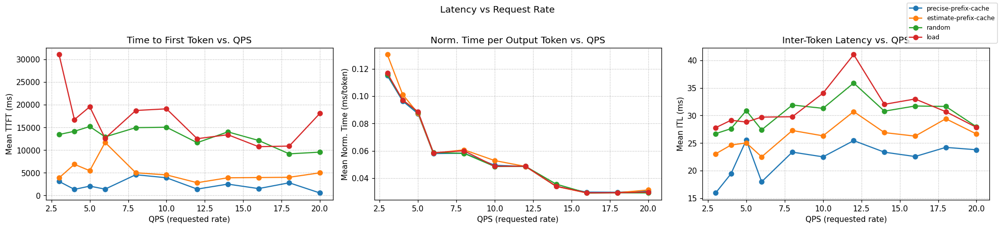
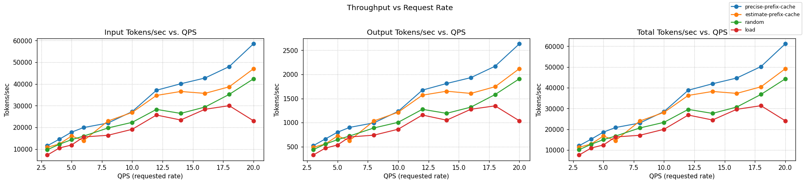
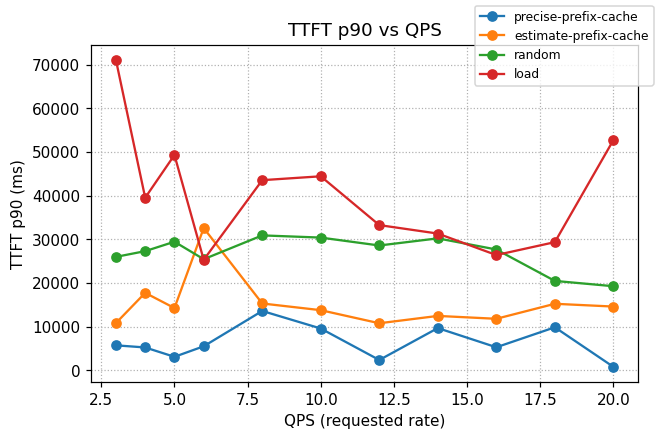

# Inference-Perf Benchmark Report

### Workload profile

```yaml
# L1 — Short prompts; each stage ≈ 1–2 FULL SETS (high-QPS showcase, ≤20 rps)
#
# FIXED
# - Pods: 4, TP=4 → effective per-pod KV is the min rank = 141,056 tokens
# - Prompt shape: L_shared=3,500; L_question=512; output=192 → live decode L_live≈96
#
# CAPACITY → SLOTS (assume steady C≈6 in-flight per pod at ≤20 rps cluster)
# - Ephemeral per request = L_question+L_live = 512+96 = 608
# - Ephemeral per pod = C*608 = 6*608 = 3,648
# - Remaining per pod for shared prefixes = 141,056 − 3,648 = 137,408
# - Slots per pod = floor(137,408 / 3,500) ≈ 39
# - Slots cluster-wide = 4 * 39 = 156
#
# OVERFILL %
# - Used groups = G = 100 (cluster-wide)
# - Slots available (cluster) = 156
# - Overfill% = (G − slots_cluster) / slots_cluster × 100
#   = (100 − 156) / 156 ≈ −35.9%  → ~36% headroom (no thrash expected)
# If evenly distributed, 25 groups per pod, which is 25/39 ≈ 64% of the slots per pod.
#
# SET SIZE & PER-STAGE COVERAGE
# - One FULL SET = S = G*P = 100*2 = 200 requests
# - Sets per stage ≈ (rate * duration) / S
#   • 3 rps x 120s = 360 requests → 360 / 200 = 1.8 sets
#   • 4 rps x 100s = 400 requests → 400 / 200 = 2 sets
#   • 5 rps x 90s = 450 requests → 450 / 200 = 2.25 sets
#   • 6 rps x 60s = 360 requests → 360 / 200 = 1.8 sets
#   • 8 rps x 60s = 480 requests → 480 / 200 = 2.4 sets
#   • 10 rps x 50s = 500 requests → 500 / 200 = 2.5 sets
#   • 12 rps x 50s = 600 requests → 600 / 200 = 3 sets
#   • 14 rps x 35s = 490 requests → 490 / 200 = 2.45 sets
#   • 16 rps x 30s = 480 requests → 480 / 200 = 2.4 sets
#   • 18 rps x 30s = 540 requests → 540 / 200 = 2.7 sets
#   • 20 rps x 30s = 600 requests → 600 / 200 = 3 sets
#
load:
  type: constant
  stages:
    - rate: 10 # PREWARM
      duration: 20
    - rate: 3
      duration: 120
    - rate: 4
      duration: 100
    - rate: 5
      duration: 90
    - rate: 6
      duration: 60
    - rate: 8
      duration: 60
    - rate: 10
      duration: 50
    - rate: 12
      duration: 50
    - rate: 14
      duration: 35
    - rate: 16
      duration: 30
    - rate: 18
      duration: 30
    - rate: 20
      duration: 30
api:
  type: completion
  streaming: true
server:
  type: vllm
  model_name: meta-llama/Llama-3.1-70B-Instruct
  base_url: http://infra-kv-events-inference-gateway.llm-d-precise.svc.cluster.local:80
  ignore_eos: true
tokenizer:
  pretrained_model_name_or_path: meta-llama/Llama-3.1-70B-Instruct
data:
  type: shared_prefix
  shared_prefix:
    num_groups: 100
    num_prompts_per_group: 2
    system_prompt_len: 3500
    question_len: 512
    output_len: 192
report:
  request_lifecycle:
    summary: true
    per_stage: true
    per_request: true
storage:
  local_storage:
    path: /workspace
```

### Scheduler Configurations

**random**

```yaml
apiVersion: inference.networking.x-k8s.io/v1alpha1
kind: EndpointPickerConfig
plugins:
- type: single-profile-handler
- type: random-picker
schedulingProfiles:
- name: default
  plugins:
    - pluginRef: random-picker
```

**load**

```yaml
apiVersion: inference.networking.x-k8s.io/v1alpha1
kind: EndpointPickerConfig
plugins:
- type: queue-scorer
- type: kv-cache-scorer
- type: max-score-picker
  parameters:
    maxNumOfEndpoints: 1
- type: single-profile-handler
schedulingProfiles:
- name: default
  plugins:
  - pluginRef: queue-scorer
    weight: 1
  - pluginRef: kv-cache-scorer
    weight: 1
  - pluginRef: max-score-picker
```

**estimate-prefix-cache**

```yaml
apiVersion: inference.networking.x-k8s.io/v1alpha1
kind: EndpointPickerConfig
plugins:
- type: queue-scorer
- type: kv-cache-scorer
- type: prefix-cache-scorer
  parameters:
    hashBlockSize: 256 # vllm block-size (64) x4
    maxPrefixBlocksToMatch: 256
    lruCapacityPerServer: 2200 # per-Pod KVCache size (~141K) / block size (64)
- type: max-score-picker
  parameters:
    maxNumOfEndpoints: 1
- type: single-profile-handler
schedulingProfiles:
- name: default
  plugins:
  - pluginRef: queue-scorer
    weight: 1
  - pluginRef: kv-cache-scorer
    weight: 1
  - pluginRef: prefix-cache-scorer
    weight: 1
  - pluginRef: max-score-picker
```

**precise-prefix-cache**

```yaml
apiVersion: inference.networking.x-k8s.io/v1alpha1
kind: EndpointPickerConfig
plugins:
- type: single-profile-handler
- type: prefix-cache-scorer
  parameters:
    mode: cache_tracking
    indexerConfig:
      tokenProcessorConfig:
        blockSize: 64   
        hashSeed: "42"
      kvBlockIndexConfig:
        enableMetrics: true    
        metricsLoggingInterval: 60000000000 
- type: kv-cache-scorer
- type: queue-scorer
- type: max-score-picker
schedulingProfiles:
- name: default
  plugins:
    - pluginRef: prefix-cache-scorer
      weight: 1.0
    - pluginRef: kv-cache-scorer
      weight: 1.0
    - pluginRef: queue-scorer
      weight: 1.0
    - pluginRef: max-score-picker
```

## Charts

### Latency vs QPS



### Throughput vs QPS



### TTFT p90 vs QPS



> Intuition: at high QPS, with precise scheduling, the entire generated KV load is balanced across the distributed
> KV-cache pools - total load generates about 75% of the available capacity.

### How to read this report (quick)

- **Output tokens/sec** is the primary throughput metric (higher is better).

- **Requests/sec** shows the rate of completed requests.

- **Success Rate** reflects outcome quality, not volume.

- **TTFT** is time to first token; **ITL** is the gap between tokens (both lower is better).

### Summary across QPS


| Experiment | Output toks/s | Requests/s | Success Rate | TTFT p90 (s) | TTFT mean (s) | ITL mean (s) | ITL p50/ p90 (s) |
|---|---:|---:|---:|---:|---:|---:|---:|
| precise-prefix-cache | 1393.5 | 8.017 | 99.83% | 6.314 | 2.260 | 0.023 | 0.0000/0.032 |
| estimate-prefix-cache | 1211.9 | 7.696 | 99.96% | 14.933 | 4.976 | 0.027 | 0.0000/0.077 |
| random | 1048.4 | 7.990 | 99.92% | 26.720 | 12.749 | 0.031 | 0.0000/0.084 |
| load | 863.8 | 7.971 | 99.89% | 40.169 | 16.301 | 0.032 | 0.0000/0.084 |

## Per-QPS Results


### QPS = 3.0


| Experiment | Output toks/s | Requests/s | Success Rate | TTFT p90 (s) | TTFT mean (s) | ITL mean (s) | ITL p50/ p90 (s) |
|---|---:|---:|---:|---:|---:|---:|---:|
| precise-prefix-cache | 520.9 | 3.040 | 100.00% | 5.711 | 3.101 | 0.016 | 0.0000/0.028 |
| estimate-prefix-cache | 487.1 | 2.682 | 100.00% | 10.807 | 3.887 | 0.023 | 0.0000/0.083 |
| random | 438.4 | 3.014 | 99.17% | 25.977 | 13.443 | 0.027 | 0.0000/0.084 |
| load | 326.0 | 2.998 | 100.00% | 71.080 | 31.058 | 0.028 | 0.0000/0.084 |

### QPS = 4.0


| Experiment | Output toks/s | Requests/s | Success Rate | TTFT p90 (s) | TTFT mean (s) | ITL mean (s) | ITL p50/ p90 (s) |
|---|---:|---:|---:|---:|---:|---:|---:|
| precise-prefix-cache | 660.4 | 4.031 | 100.00% | 5.223 | 1.351 | 0.019 | 0.0000/0.033 |
| estimate-prefix-cache | 556.2 | 3.840 | 99.75% | 17.734 | 6.875 | 0.025 | 0.0000/0.084 |
| random | 554.1 | 4.000 | 100.00% | 27.291 | 14.150 | 0.028 | 0.0000/0.084 |
| load | 470.5 | 4.002 | 98.50% | 39.528 | 16.727 | 0.029 | 0.0000/0.085 |

### QPS = 5.0


| Experiment | Output toks/s | Requests/s | Success Rate | TTFT p90 (s) | TTFT mean (s) | ITL mean (s) | ITL p50/ p90 (s) |
|---|---:|---:|---:|---:|---:|---:|---:|
| precise-prefix-cache | 799.5 | 5.014 | 100.00% | 3.078 | 2.069 | 0.026 | 0.0000/0.033 |
| estimate-prefix-cache | 722.2 | 4.995 | 100.00% | 14.250 | 5.469 | 0.025 | 0.0000/0.084 |
| random | 645.4 | 4.949 | 99.78% | 29.446 | 15.206 | 0.031 | 0.0000/0.084 |
| load | 535.1 | 4.937 | 100.00% | 49.317 | 19.557 | 0.029 | 0.0000/0.085 |

### QPS = 6.0


| Experiment | Output toks/s | Requests/s | Success Rate | TTFT p90 (s) | TTFT mean (s) | ITL mean (s) | ITL p50/ p90 (s) |
|---|---:|---:|---:|---:|---:|---:|---:|
| precise-prefix-cache | 900.1 | 6.027 | 100.00% | 5.492 | 1.407 | 0.018 | 0.0000/0.032 |
| load | 701.7 | 5.971 | 100.00% | 25.308 | 12.623 | 0.030 | 0.0000/0.084 |
| random | 721.2 | 5.942 | 100.00% | 25.441 | 12.918 | 0.027 | 0.0000/0.084 |
| estimate-prefix-cache | 627.6 | 5.998 | 100.00% | 32.576 | 11.696 | 0.023 | 0.0000/0.083 |

### QPS = 8.0


| Experiment | Output toks/s | Requests/s | Success Rate | TTFT p90 (s) | TTFT mean (s) | ITL mean (s) | ITL p50/ p90 (s) |
|---|---:|---:|---:|---:|---:|---:|---:|
| precise-prefix-cache | 993.9 | 7.997 | 98.33% | 13.585 | 4.582 | 0.023 | 0.0000/0.032 |
| estimate-prefix-cache | 1033.9 | 7.673 | 99.79% | 15.299 | 5.016 | 0.027 | 0.0000/0.083 |
| random | 888.6 | 8.010 | 100.00% | 30.898 | 14.954 | 0.032 | 0.0000/0.084 |
| load | 738.7 | 7.772 | 100.00% | 43.550 | 18.738 | 0.030 | 0.0000/0.085 |

### QPS = 10.0


| Experiment | Output toks/s | Requests/s | Success Rate | TTFT p90 (s) | TTFT mean (s) | ITL mean (s) | ITL p50/ p90 (s) |
|---|---:|---:|---:|---:|---:|---:|---:|
| precise-prefix-cache | 1232.0 | 9.817 | 100.00% | 9.563 | 3.909 | 0.023 | 0.0000/0.031 |
| estimate-prefix-cache | 1214.4 | 9.180 | 100.00% | 13.764 | 4.543 | 0.026 | 0.0000/0.080 |
| random | 1004.9 | 9.996 | 100.00% | 30.396 | 15.046 | 0.031 | 0.0000/0.084 |
| load | 861.8 | 9.974 | 100.00% | 44.439 | 19.100 | 0.034 | 0.0000/0.084 |

### QPS = 12.0


| Experiment | Output toks/s | Requests/s | Success Rate | TTFT p90 (s) | TTFT mean (s) | ITL mean (s) | ITL p50/ p90 (s) |
|---|---:|---:|---:|---:|---:|---:|---:|
| precise-prefix-cache | 1673.2 | 11.976 | 99.83% | 2.353 | 1.415 | 0.025 | 0.0000/0.033 |
| estimate-prefix-cache | 1568.9 | 11.979 | 100.00% | 10.769 | 2.822 | 0.031 | 0.0000/0.036 |
| random | 1275.3 | 11.954 | 100.00% | 28.584 | 11.643 | 0.036 | 0.0000/0.084 |
| load | 1156.9 | 11.954 | 100.00% | 33.256 | 12.516 | 0.041 | 0.0000/0.084 |

### QPS = 14.0


| Experiment | Output toks/s | Requests/s | Success Rate | TTFT p90 (s) | TTFT mean (s) | ITL mean (s) | ITL p50/ p90 (s) |
|---|---:|---:|---:|---:|---:|---:|---:|
| precise-prefix-cache | 1811.4 | 13.955 | 100.00% | 9.660 | 2.510 | 0.023 | 0.0000/0.032 |
| estimate-prefix-cache | 1651.2 | 13.979 | 100.00% | 12.450 | 3.906 | 0.027 | 0.0000/0.080 |
| random | 1192.1 | 13.327 | 100.00% | 30.219 | 14.020 | 0.031 | 0.0000/0.084 |
| load | 1050.3 | 13.944 | 100.00% | 31.318 | 13.394 | 0.032 | 0.0000/0.084 |

### QPS = 16.0


| Experiment | Output toks/s | Requests/s | Success Rate | TTFT p90 (s) | TTFT mean (s) | ITL mean (s) | ITL p50/ p90 (s) |
|---|---:|---:|---:|---:|---:|---:|---:|
| precise-prefix-cache | 1932.7 | 15.618 | 100.00% | 5.267 | 1.526 | 0.023 | 0.0000/0.032 |
| estimate-prefix-cache | 1605.4 | 15.952 | 100.00% | 11.791 | 3.954 | 0.026 | 0.0000/0.080 |
| load | 1276.7 | 15.896 | 100.00% | 26.396 | 10.762 | 0.033 | 0.0000/0.084 |
| random | 1320.7 | 15.942 | 100.00% | 27.666 | 12.132 | 0.032 | 0.0000/0.084 |

### QPS = 18.0


| Experiment | Output toks/s | Requests/s | Success Rate | TTFT p90 (s) | TTFT mean (s) | ITL mean (s) | ITL p50/ p90 (s) |
|---|---:|---:|---:|---:|---:|---:|---:|
| precise-prefix-cache | 2170.5 | 17.614 | 100.00% | 9.844 | 2.803 | 0.024 | 0.0000/0.033 |
| estimate-prefix-cache | 1744.8 | 17.818 | 100.00% | 15.229 | 4.017 | 0.029 | 0.0000/0.080 |
| random | 1582.2 | 17.872 | 100.00% | 20.470 | 9.182 | 0.032 | 0.0000/0.084 |
| load | 1347.0 | 17.853 | 100.00% | 29.354 | 10.890 | 0.031 | 0.0000/0.083 |

### QPS = 20.0


| Experiment | Output toks/s | Requests/s | Success Rate | TTFT p90 (s) | TTFT mean (s) | ITL mean (s) | ITL p50/ p90 (s) |
|---|---:|---:|---:|---:|---:|---:|---:|
| precise-prefix-cache | 2634.2 | 19.097 | 100.00% | 0.780 | 0.556 | 0.024 | 0.0000/0.033 |
| estimate-prefix-cache | 2119.7 | 18.536 | 100.00% | 14.594 | 5.000 | 0.027 | 0.0000/0.083 |
| random | 1909.2 | 19.898 | 100.00% | 19.254 | 9.558 | 0.028 | 0.0000/0.084 |
| load | 1036.8 | 19.515 | 100.00% | 52.725 | 18.110 | 0.028 | 0.0000/0.084 |