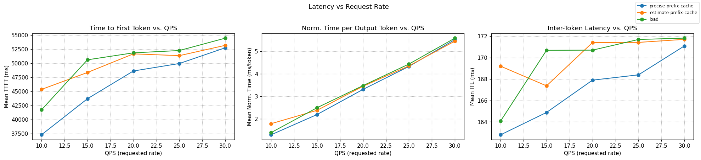
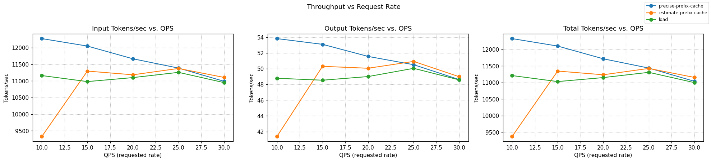

# InferencePerf Benchmark Report

## Configuration

### Workload profile (shown once)

```yaml
load:
  type: constant
  stages:
  - rate: 10
    duration: 50
  - rate: 15
    duration: 50
  - rate: 20
    duration: 50
  - rate: 25
    duration: 50
  - rate: 30
    duration: 50
api:
  type: completion
  streaming: true
server:
  type: vllm
  model_name: meta-llama/Llama-3.1-70B-Instruct
  base_url: http://inference-gateway.e2e-solution2.svc.cluster.local:80
  ignore_eos: true
tokenizer:
  pretrained_model_name_or_path: meta-llama/Llama-3.1-70B-Instruct
data:
  type: shared_prefix
  shared_prefix:
    num_groups: 60                
    num_prompts_per_group: 1     
    system_prompt_len: 4000       
    question_len: 256             
    output_len: 20               
report:
  request_lifecycle:
    summary: true
    per_stage: true
    per_request: true
storage:
  local_storage:
    path: /workspace
```

### Scheduler Configurations

**estimate-prefix-cache**

```yaml
apiVersion: inference.networking.x-k8s.io/v1alpha1
kind: EndpointPickerConfig
plugins:
- type: queue-scorer
- type: kv-cache-scorer
- type: prefix-cache-scorer
  parameters:
    hashBlockSize: 256
    maxPrefixBlocksToMatch: 256
    lruCapacityPerServer: 700
- type: max-score-picker
  parameters:
    maxNumOfEndpoints: 1
- type: single-profile-handler
schedulingProfiles:
- name: default
  plugins:
  - pluginRef: queue-scorer
    weight: 1
  - pluginRef: kv-cache-scorer
    weight: 1
  - pluginRef: prefix-cache-scorer
    weight: 1
  - pluginRef: max-score-picker
```

**load**

```yaml
apiVersion: inference.networking.x-k8s.io/v1alpha1
kind: EndpointPickerConfig
plugins:
- type: queue-scorer
- type: kv-cache-scorer
- type: max-score-picker
  parameters:
    maxNumOfEndpoints: 1
- type: single-profile-handler
schedulingProfiles:
- name: default
  plugins:
  - pluginRef: queue-scorer
    weight: 1
  - pluginRef: kv-cache-scorer
    weight: 1
  - pluginRef: max-score-picker
```

**precise-prefix-cache**

```yaml
apiVersion: inference.networking.x-k8s.io/v1alpha1
kind: EndpointPickerConfig
plugins:
- type: single-profile-handler
- type: prefix-cache-scorer
  parameters:
    mode: cache_tracking
    indexerConfig:
      tokenProcessorConfig:
        blockSize: 64   
        hashSeed: "0"   
      kvBlockIndexConfig:
        enableMetrics: true    
        metricsLoggingInterval: 60000000000 
- type: kv-cache-scorer
- type: queue-scorer
- type: max-score-picker
schedulingProfiles:
- name: default
  plugins:
    - pluginRef: prefix-cache-scorer
      weight: 1.0
    - pluginRef: kv-cache-scorer
      weight: 1.0
    - pluginRef: queue-scorer
      weight: 1.0
    - pluginRef: max-score-picker
```

**random-routing**

```yaml
apiVersion: inference.networking.x-k8s.io/v1alpha1
kind: EndpointPickerConfig
plugins:
- type: single-profile-handler
- type: random-picker
schedulingProfiles:
- name: default
  plugins:
    - pluginRef: random-picker
```

## Charts

> NOTE: random-routing was ejected from graphs due to low success rate, which can mislead the analysis.

### Latency vs QPS



### Throughput vs QPS



### How to read this report (quick)

- **TTFT** is time to first token; **ITL** is the gap between tokens (both lower is better).
- **TTFT p50/p90** shows median/90th percentile latency for the first token.
- **Output tokens/sec** is the primary throughput metric (higher is better).

- **Requests/sec** shows the rate of completed requests.

- **Success Rate** reflects outcome quality, not volume.

### Summary across QPS


| Experiment | Output toks/s | Requests/s | Success Rate | TTFT mean (s) | TTFT p50/ p90 (s) | ITL mean (s) | ITL p50/ p90 (s) |
|---|---:|---:|---:|---:|---:|---:|---:|
| precise-prefix-cache | 51.5 | 3.109 | 98.50% | 48.296 | 53.928/58.888 | 0.168 | 0.0001/0.380 |
| load | 49.0 | 2.938 | 99.68% | 51.552 | 56.629/59.333 | 0.171 | 0.0001/0.379 |
| estimate-prefix-cache | 48.3 | 2.925 | 99.42% | 50.926 | 56.346/59.241 | 0.171 | 0.0001/0.379 |
| random-routing | 37.4 | 3.047 | 75.08% | 44.557 | 47.333/58.904 | 0.171 | 0.0001/0.379 |

## Per-QPS Results (sorted by **Output toks/s**, then **Success Rate**, then **TTFT**)


### QPS = 10.0


| Experiment | Output toks/s | Requests/s | Success Rate | TTFT mean (s) | TTFT p50/ p90 (s) | ITL mean (s) | ITL p50/ p90 (s) |
|---|---:|---:|---:|---:|---:|---:|---:|
| precise-prefix-cache | 53.8 | 4.019 | 99.20% | 37.264 | 46.278/54.994 | 0.163 | 0.0001/0.380 |
| load | 48.8 | 3.689 | 98.40% | 41.703 | 53.378/58.324 | 0.164 | 0.0001/0.378 |
| estimate-prefix-cache | 41.4 | 2.859 | 97.60% | 45.342 | 51.517/58.162 | 0.169 | 0.0001/0.378 |
| random-routing | 38.8 | 3.700 | 79.40% | 33.875 | 37.103/49.482 | 0.168 | 0.0001/0.378 |

### QPS = 15.0


| Experiment | Output toks/s | Requests/s | Success Rate | TTFT mean (s) | TTFT p50/ p90 (s) | ITL mean (s) | ITL p50/ p90 (s) |
|---|---:|---:|---:|---:|---:|---:|---:|
| precise-prefix-cache | 53.1 | 3.545 | 99.07% | 43.684 | 48.771/58.703 | 0.165 | 0.0001/0.381 |
| estimate-prefix-cache | 50.3 | 3.216 | 99.47% | 48.355 | 56.182/59.241 | 0.167 | 0.0001/0.379 |
| load | 48.5 | 3.074 | 99.73% | 50.610 | 56.645/59.318 | 0.171 | 0.0001/0.379 |
| random-routing | 36.4 | 3.189 | 75.07% | 43.595 | 46.397/59.386 | 0.170 | 0.0001/0.379 |

### QPS = 20.0


| Experiment | Output toks/s | Requests/s | Success Rate | TTFT mean (s) | TTFT p50/ p90 (s) | ITL mean (s) | ITL p50/ p90 (s) |
|---|---:|---:|---:|---:|---:|---:|---:|
| precise-prefix-cache | 51.6 | 3.128 | 99.70% | 48.624 | 55.430/59.024 | 0.168 | 0.0001/0.380 |
| estimate-prefix-cache | 50.1 | 2.956 | 100.00% | 51.667 | 57.167/59.310 | 0.171 | 0.0001/0.379 |
| load | 49.0 | 2.938 | 99.70% | 51.849 | 56.569/59.403 | 0.171 | 0.0001/0.379 |
| random-routing | 35.5 | 3.027 | 71.60% | 44.716 | 47.554/60.310 | 0.170 | 0.0001/0.379 |

### QPS = 25.0


| Experiment | Output toks/s | Requests/s | Success Rate | TTFT mean (s) | TTFT p50/ p90 (s) | ITL mean (s) | ITL p50/ p90 (s) |
|---|---:|---:|---:|---:|---:|---:|---:|
| precise-prefix-cache | 50.5 | 2.986 | 97.68% | 49.953 | 55.743/59.648 | 0.168 | 0.0001/0.380 |
| estimate-prefix-cache | 50.9 | 2.925 | 99.76% | 51.353 | 56.471/59.374 | 0.171 | 0.0001/0.380 |
| load | 50.0 | 2.878 | 100.00% | 52.263 | 56.724/59.407 | 0.172 | 0.0001/0.379 |
| random-routing | 40.1 | 2.869 | 82.32% | 49.748 | 52.895/60.109 | 0.171 | 0.0001/0.379 |

### QPS = 30.0


| Experiment | Output toks/s | Requests/s | Success Rate | TTFT mean (s) | TTFT p50/ p90 (s) | ITL mean (s) | ITL p50/ p90 (s) |
|---|---:|---:|---:|---:|---:|---:|---:|
| estimate-prefix-cache | 49.0 | 2.800 | 99.33% | 53.187 | 57.355/59.438 | 0.172 | 0.0001/0.379 |
| precise-prefix-cache | 48.6 | 2.808 | 97.87% | 52.756 | 56.594/59.574 | 0.171 | 0.0001/0.380 |
| load | 48.6 | 2.740 | 99.80% | 54.468 | 57.649/59.562 | 0.172 | 0.0001/0.379 |
| random-routing | 36.1 | 2.973 | 69.93% | 43.916 | 46.101/60.071 | 0.172 | 0.0001/0.380 |
